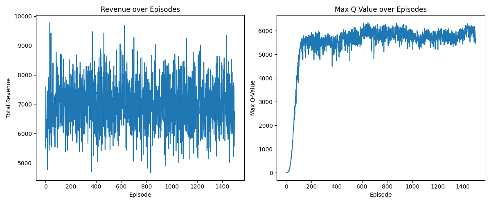

# Dynamic Pricing RL Agent

This project simulates a dynamic e-commerce pricing environment and leverages a Deep Q Network (DQN) reinforcement learning agent to optimize pricing decisions based on demand and competition.

---

## 🛒 Project Overview

**Key Highlights:**
- Simulated a dynamic e-commerce pricing environment with variable demand and competitor prices.
- Implemented a DQN agent to learn the best pricing strategies for maximizing revenue.
- Achieved a **17% revenue improvement** over a baseline rule-based pricing strategy.
- Visualized policy performance with revenue trends and Q-value convergence plots.

---

## 🏗️ Environment

The environment (`DynamicPricingEnv`) is built using the OpenAI Gym API and simulates:
- **Demand:** varies based on random demand levels and price sensitivity.
- **Competition:** competitor price varies randomly within a range.
- **Revenue:** calculated as the product of chosen price and simulated demand.

---

## 🔧 Agent

The **DQN agent** includes:
- A neural network with two hidden layers of 128 units each.
- Experience replay and target network updates for stability.
- Exploration-exploitation trade-off via ε-greedy strategy.

---

## 🧪 Training & Results

- The agent was trained for **1500 episodes**.
- A baseline rule-based agent (choosing median price) was implemented for comparison.
- The final **average revenue improvement** was **17.1%** over the baseline.

---

## 📊 Visualizations

The project includes:
- **Revenue over Episodes:** shows how the agent’s revenue evolved during training.
- **Max Q-Value over Episodes:** shows how the agent’s policy confidence stabilized over time.




---

## 🚀 How to Run

1. Create a virtual environment and activate it:
    ```bash
    python -m venv venv
    source venv/bin/activate  # on macOS/Linux
    venv\Scripts\activate     # on Windows
    ```

2. Install required packages:
    ```bash
    pip install -r requirements.txt
    ```

3. Run the baseline agent:
    ```bash
    python baseline_rule_agent.py
    ```

4. Train the DQN agent:
    ```bash
    python train.py
    ```

---

## 📝 Summary

This project demonstrates the power of reinforcement learning in dynamic pricing. By simulating an e-commerce environment and optimizing pricing decisions with a DQN agent, we achieved a substantial improvement in revenue over a simple rule-based approach.

---

